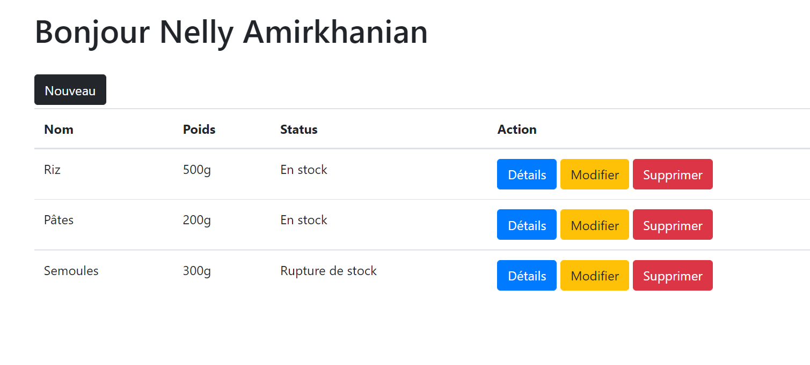

<h1> Portfolio CRUD in Express</h1>

I have used NodeJS environnment, Express framework and MySQL database to make this project

<h2> Development server </h2>

Run <code>npm start</code> for a dev server. Navigate to http://localhost:12345/ The app will automatically reload if you change any of the source files.

Run <code>npm install</code>  to install all the project dependancies

